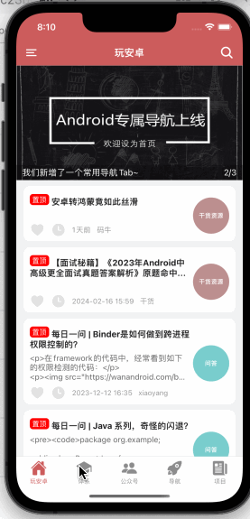

# React Native（Expo） 版 WanAndroid 客户端

## 简介
Expo WanAndroid基于React Native 0.73版本和expo 50，网络请求和状态管理使用最新版本redux toolkit。APP设计参考[RN_WanAndroid](https://github.com/aijason/RN_WanAndroid)

## 交互设计原则
### GET接口指示：
1. 上拉下拉刷新可以由头部、底部视图进行指示。(adopted)
2. 初次进入展示缓存数据时，展示头部刷新视图。不展示缓存数据时，需要Loading toast。
3. 刷新、加载更多也可使用toast，遮挡型会阻止用户滚动，但可以避免重复刷新和加载的问题。否则需要锁定，避免重复触发。
4. 加载成功不需要提示，新增数据会消除空白，或自然将底部视图推出屏幕可见区。列表无数据需要有空视图提示。
5. 初次加载出错，需要重试按钮。不宜作为列表的空视图，需要避免触发列表的底部加载更多，而且会露出头部和底部，最好单独展示错误页。该错误页也适用于其他非列表页面的接口。
6. 刷新、加载更多，失败需要提示，可以选择顶部、底部、中间的toast（prefer）
>综上所述，需要上拉、下拉指示，列表空页面，加载失败页，加载中、失败toast

### POST接口指示：
1. 可以将提交按钮加上Loading动画，既避免重复提交、又能展示提交中。(good)
或者使用Loading toast，遮挡型会阻止长表单的滚动，但可以避免重复提交。(simple and good)
2. 提交成功和失败都需要提示，可以选择顶部、底部、中间的toast（prefer）
>综上所述，需要loading按钮或toast，失败和成功toast


### 对于需要登录的接口
1. 如果是GET，要显示登录按钮，使用加载失败页处理
2. 如果是POST，则直接跳转登录页面，接口拦截器直接处理
>考虑：登录成功后的落地页如何确定

## iOS项目截图


## 主要功能

* 首页、体系、公众号、导航、项目五大模块；
* 登录注册功能；
* 搜索功能：热门搜索、搜索历史文章；
* 收藏功能：添加收藏、取消收藏；
* 浏览文章、分享文章；
* 查看常用网站；
* 自定义切换主题颜色功能；
* 多语言切换功能；
* 我的积分明细；
* 关于模块。

## 部分实现技术点
### 国际化
国际化主要依赖i18n-js库，主要就是对其设置locale，配置locale对应的翻译文件。基本的使用是用原文为key，取得对应的译文。i18n-js本身还支持插值、scope以及其他高级的功能。本项目只使用简单的映射以及插值功能。

为了在输入代码的时候得到编译器提示，我们先创建了一个`LanguageMapper`对象，它是一个字面量对象，键是你给需要本地化的文本指定的助记名，一般采用"位置+功能"、“功能+内容”之类的组合，例如"menu_home"，"toast_pwd_empty"等，这个可以随意指定规则。值一般是英文原文，当然也可以是其他文本。鉴于客户端范围文件比较常见的格式是"英文:译文"，因此这里设为英文原文。然后我们创建一个`LanguageResource`类型，该类型以`LanguageMapper`类型的值作为键。我们为每种语言创建一个该类型的对象，并且将翻译映射对作为其键值。

然后我们实现一个以`LanguageMapper`键作为参数的翻译快捷方法，这样我们每次调用这个方法时，既可以直接输入助记名，也可以通过`LanguageMapper`来访问这个助记名，编译器都会为我们提供代码补全提示，如图所示：


### redux toolkit实现分页加载

redux toolkit中将一个接口称作`endpoint`，一个`endpoint`可以是query，也可以是mutation。前者是查询数据，后者则会引起数据变化。我们往往需要对查询数据进行缓存，而在变化发生的时候，将对应的数据标记为失效，然后重新获取。

接口地址、采用的method以及请求body在query里进行设置。redux toolkit一般使用序列化的参数作为缓存数据的key，以便下次查询及获得该数据。那么对于分页数据，我们需要把每一页的数据都存在一个地方，因此需要通过`serializeQueryArgs`指定一个序列化的键值，这里可以视情况而定，如果除了分页参数，没有别的参数了，那可以直接使用`endpointName`。如果还有别的参数，那可以从中去掉分页参数，将返回的对象作为key的来源。还要实现`merge`方法，用来处理请求数据和缓存数据的关系，对于分页请求，一般就是把请求到的数组追加到缓存数组的后面。如果还支持下拉刷新的话，那么当取得第一页数据时，要丢弃缓存数据，而返回请求数据。`forceRefetch`这里可以不实现。一般的实现代码：
```ts
// 1.1首页文章列表
getArticleList: builder.query<ListResponse<Article>, number>({
    query: (page = 0) => ({
        url: `article/list/${page}/json?page_size=10`,
        method: 'GET'
    }),
    // Only have one cache entry because the arg always maps to one string
    serializeQueryArgs: ({ endpointName }) => {
        return endpointName
    },
    merge: (current, newItems, other) => {
        if (other.arg == 0) {
            return newItems
        }
        return { ...current, datas: [...current.datas, ...newItems.datas] }
    },
    forceRefetch() {
        return true
    },
}),
```


## 已知问题
* 同一篇文章在不同位置的收藏状态不同步


## 声明
本项目使用的 API 均来自于 [www.wanandroid.com](www.wanandroid.com) 网站，纯属学习交流使用，不得用于商业用途。
